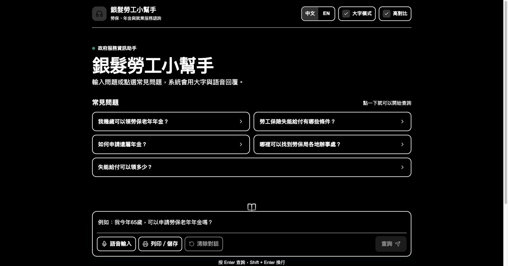

# Elder Labor Assistant (ELDERv1)

An accessible, bilingual Retrieval-Augmented Generation (RAG) assistant that answers
Taiwan labor-insurance, pension, and senior-employment questions for older adults.

Built as a master's thesis prototype. Queries and answers work in Traditional Chinese
and English, every answer is grounded in official government sources, and the interface
is designed around older users: large text, a high-contrast mode, one-tap FAQ buttons,
voice input, and spoken answers.


| Grounded answer with citations | High-contrast mode |
|---|---|
|  |  |

---

## Why this is not just a chatbot wrapper

The retrieval layer does more than a single vector lookup:

- **Intent routing.** Office-location questions ("Where is the Taichung BLI office?")
  bypass the language model entirely and return a structured record — address, phone,
  service hours, official link — straight from the indexed dataset, so the details
  cannot be hallucinated.
- **Deterministic lookup for exact tables.** Disability-benefit day counts are served
  from a fixed table rather than generated, because a wrong number here is a real harm.
- **Filtered vector search.** A `type` payload index lets office questions search only
  office records instead of the whole corpus.
- **Dedup + MMR re-ranking.** Retrieved chunks are deduplicated by URL/title and
  re-ranked for source diversity, so answers do not cite the same page five times.
- **Location disambiguation.** If a user asks for an office without naming a city, the
  system asks which city and offers examples drawn from the live index.
- **Graceful insufficiency.** When retrieval does not support an answer, the system says
  so and points to official channels instead of guessing.
- **Built-in ablation mode.** `mode=llm_only` disables retrieval so the same question set
  can be run against a bare-model baseline. This is what the evaluation below uses.

The interface is built for the audience rather than for a demo reel: 18px minimum body
text, a big-text mode (30px, on by default), a true high-contrast theme, 44px+ touch
targets, visible focus rings, a print stylesheet, voice input and spoken answers, and
saved display preferences. Themes are driven by CSS custom properties, so restyling
cannot silently break contrast mode.

---

## Evaluation

50 fixed questions (45 Traditional Chinese, 5 English) covering office lookup, benefit
guidance, coverage, premiums, disability standards, penalties, and boundary cases.
Both conditions use the same model and temperature; the baseline differs only in having
retrieval disabled.

| Metric | RAG system | LLM-only baseline |
|---|---:|---:|
| Queries | 50 | 50 |
| Success rate | 50/50 (100%) | 50/50 (100%) |
| Mean latency | 1592.5 ms | 1750.4 ms |
| Avg. retrieved sources | 3.46 | 0 |
| Answers with zero sources | 0/50 | 50/50 |
| Expected source retrieved | 47/50 | N/A |
| Expected source ranked first | 38/50 | N/A |

The gap is widest on office-location and exact-table questions, where the RAG system
returns verifiable specifics and the baseline offers generic advice to "check the
official website."

Not every question goes through the language model. Of the 50:

| Route | Count | Behavior |
|---|---:|---|
| `rag` | 37 | Retrieve, re-rank, generate a grounded answer |
| `office_lookup` | 9 | Return a structured office record; no generation |
| `disability_standard_lookup` | 4 | Return the exact benefit-day figure from a fixed table |

The 13 non-generative answers are precisely the ones where a hallucinated address or
day count would cause real harm.

**Human comparison is weaker and reported as such.** A single-rater side-by-side on the
12-question subset preferred the RAG answer in 12/12 cases. A separate two-rater
comparison across all 50 questions reached only 66% raw agreement (Cohen's κ = 0.105 —
slight), so the subjective preference data does not establish much on its own. The
objective retrieval metrics above carry the argument.

Other limitations: relevant sources are sometimes retrieved but not ranked first when
statute pages and administrative interpretations overlap semantically; English retrieval
is weaker than Chinese; boundary/safety questions are hard to score by expected-source
matching, since the correct behavior is often to decline rather than to retrieve; and
each condition was run once, so no variance is reported.

Raw runs, per-question scoring, the rating data, and a script that recomputes every
figure above are in [`evaluation/`](evaluation/).

---

## Architecture

```
┌─────────────────┐      ┌──────────────────┐      ┌─────────────┐
│  Next.js 15     │─────▶│  Express API     │─────▶│   Qdrant    │
│  React 19       │◀─────│  retriever-api   │◀─────│  vectors    │
│  zh / en routes │      │                  │      └─────────────┘
└─────────────────┘      │  intent routing  │
                         │  MMR re-rank     │      ┌─────────────┐
                         │  answer + audio  │─────▶│   OpenAI    │
                         └──────────────────┘      │  ElevenLabs │
                                                   └─────────────┘
```

| Component | Stack | Path |
|---|---|---|
| Frontend | Next.js 16 (App Router), React 19, TypeScript | `apps/frontend` |
| Retriever API | Express 5, OpenAI, Qdrant, ElevenLabs | `apps/retriever-api` |
| Ingestion | Python, pandas, LangChain, tiktoken | `ingestion` |
| Vector store | Qdrant (Docker) | `docker` |

Models: `gpt-4o` for answers, `text-embedding-3-large` (3072-dim) for retrieval,
`whisper-1` for voice input, ElevenLabs for speech output.

---

## Setup

**Prerequisites:** Node.js 20+, Python 3.10+, Docker.

### 1. Clone and install

```bash
git clone https://github.com/dantes-hub/thesisv1.git
cd thesisv1
npm install          # installs both apps via npm workspaces
```

### 2. Configure environment

```bash
cp apps/retriever-api/.env.example apps/retriever-api/.env
cp apps/frontend/.env.example      apps/frontend/.env
```

Fill in `OPENAI_API_KEY` at minimum. ElevenLabs keys are optional — without them the
app works, but the "read aloud" button is disabled.

Note `ALLOWED_ORIGINS` in the API config: it is the list of browser origins permitted to
call the API. It defaults to `http://localhost:3000` for local development and **must**
be set to your real frontend URL when deployed, since every endpoint spends API credits
per call.

### 3. Start Qdrant

```bash
npm run qdrant:up
```

### 4. Ingest the source data

The government source CSVs are not redistributed here. Place them in
`ingestion/data/` and run:

```bash
cd ingestion
python -m venv .venv && source .venv/bin/activate
pip install -r requirements.txt

python ingest_law.py                    # data/law_regulations.csv
python ingest_office.py                 # data/offices.csv
python ingest_disability_standards.py   # data/A17000000J-030152-gJm.csv
```

Each script accepts an alternative path as its first argument.

### 5. Run

```bash
npm run dev:api      # http://localhost:8000
npm run dev:web      # http://localhost:3000
```

Open http://localhost:3000 — it redirects to `/zh`. Use `/en` for English.

---

## Run with Docker

The whole stack — Qdrant, API, and frontend — comes up with one command:

```bash
cp apps/retriever-api/.env.example apps/retriever-api/.env   # add your OPENAI_API_KEY
docker compose up --build
```

Then open http://localhost:3000. Ingest data into the running Qdrant using the
ingestion steps above (the containers expose Qdrant on its usual port).

Two things worth knowing about the images:

- `NEXT_PUBLIC_API_URL` is **baked into the frontend at build time**, because Next.js
  inlines `NEXT_PUBLIC_*` values into the client bundle. Setting it at runtime on an
  already-built image has no effect. Compose passes it as a build argument; override it
  for a deployed build:

  ```bash
  NEXT_PUBLIC_API_URL=https://api.example.com docker compose build web
  ```

- It is the URL the **browser** calls, so it must be the publicly reachable API address,
  not the internal compose service name. The API reaches Qdrant the other way round, at
  `http://qdrant:6333` on the compose network.

Both images run as a non-root user, install production dependencies only, and the
frontend ships as a Next.js standalone bundle. The API image includes a healthcheck
against `/health`.

For day-to-day development prefer `npm run qdrant:up` plus `npm run dev:api` /
`npm run dev:web`, which give you hot reload.

---

## API

| Method | Endpoint | Purpose | Rate limit |
|---|---|---|---|
| `GET` | `/health` | Qdrant connectivity and collection list | 60/min |
| `POST` | `/ask` | `{ q, lang, mode }` → grounded answer + sources | 10/min |
| `POST` | `/tts` | `{ text, lang }` → MP3 audio | 10/min |
| `POST` | `/transcribe` | multipart audio → transcript | 5/min |

`mode` accepts `rag` (default) or `llm_only` for the ablation baseline.
`/debug/scroll` exists in development only and is not mounted in production.

`/ask` responses carry a `route` field naming which path answered:

| `route` | Meaning |
|---|---|
| `rag` | Retrieved, re-ranked, and generated |
| `office_lookup` | Structured office record; also returns an `office` object with `name`, `address`, `phone`, `hours`, `url`, and `map_url` |
| `disability_standard_lookup` | Exact benefit-day figure from a fixed table |

The two lookup routes never call the language model, so the answers that would do
the most harm if hallucinated — addresses and benefit day counts — are served
deterministically.

Limits are per IP. Answers and generated audio are both LRU-cached, so repeated
questions do not re-bill.

---

## Reproducing the evaluation

With the API running:

```bash
cd ingestion

# RAG condition, then the retrieval-disabled baseline, over the same question set
python run_batch.py --mode rag
python run_batch.py --mode llm_only

# Side-by-side comparison CSV
python compare_runs.py --rag ask_runs_rag_<ts>.jsonl \
                       --baseline ask_runs_llm_only_<ts>.jsonl \
                       --out_csv run_comparison.csv
```

`run_batch.py` reads `evaluation_questions_50.csv` by default (override with
`--questions`) and targets `http://localhost:8000/ask` (override with the `ASK_URL`
environment variable).

The API rate-limits `/ask` to 10 requests per minute, so a 50-question run takes a few
minutes. `run_batch.py` detects `429` and backs off, so the run completes either way —
but for a faster local run you can start the API with a higher cap:

```bash
RATE_LIMIT_ASK=100 npm run dev:api
```

---

## Tests

The retrieval logic — MMR re-ranking, source dedup, city detection, disability-grade
parsing, and office-record normalisation — lives in `apps/retriever-api/lib/retrieval.js`,
free of Express, OpenAI and Qdrant so it can be tested directly:

```bash
npm test --workspace retriever-api
```

14 tests, no test framework dependency (Node's built-in runner). CI runs these plus
lint, the frontend build, the ingestion scripts, and both Docker images on every push —
see `.github/workflows/ci.yml`.

---

## Deployment notes

**Full step-by-step runbook: [`docs/DEPLOY.md`](docs/DEPLOY.md)** — Vercel (frontend) +
Render (API) + Qdrant Cloud (vectors), all on free tiers. It covers copying the existing
vectors to the cloud without paying to re-embed them, the build-time/CORS ordering
between the two apps, and capping spend.

Set `NODE_ENV=production` on the API. This disables the debug route and stops raw
exception text from being returned to clients.

Set `ALLOWED_ORIGINS` to the deployed frontend origin. Leaving it at the default means
the deployed API rejects your own frontend.

A public URL spends real API credits on every question. Set a hard monthly spend cap on
the OpenAI account — the per-IP rate limits slow abuse but do not cap it. Setting
`CHAT_MODEL=gpt-4o-mini` cuts per-query cost roughly 17x for a demo; the default stays
`gpt-4o`, which is the model the evaluation was run against.

---

## Disclaimer

Research prototype, not a commercial product and not legal advice. Answers cite official
sources but should be verified with the Bureau of Labor Insurance before you act on them.

## License

MIT
